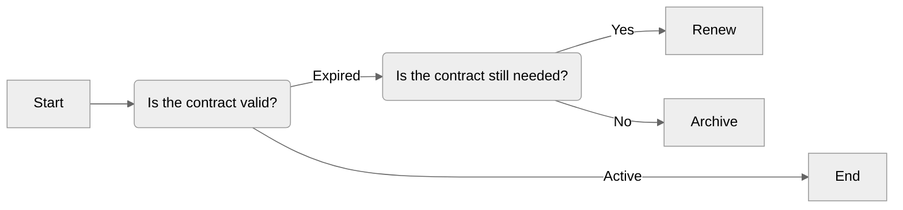

```mermaid
---
config:
  theme: neutral
---
  flowchart LR
    A[Start] --> B(Is the contract valid?)
    B -->|Expired| C(Is the contract still needed?)
    C --> |Yes|D[Renew]
    C -->|No| F[Archive]

    B ---->|Active| E[End]
```
